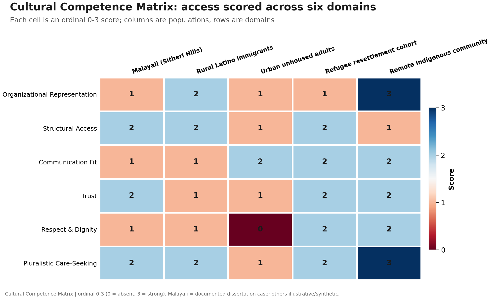
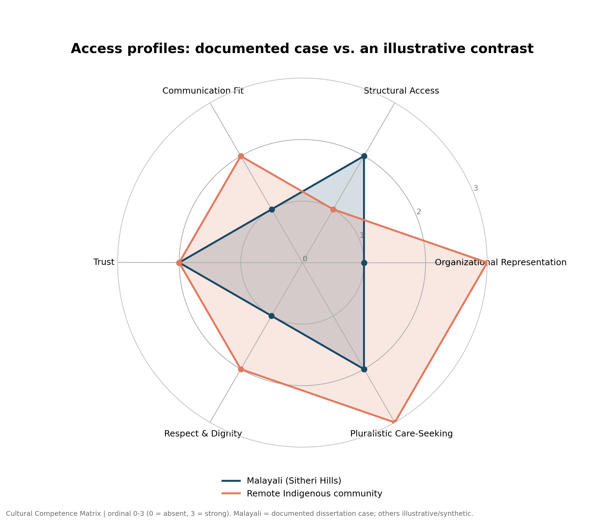
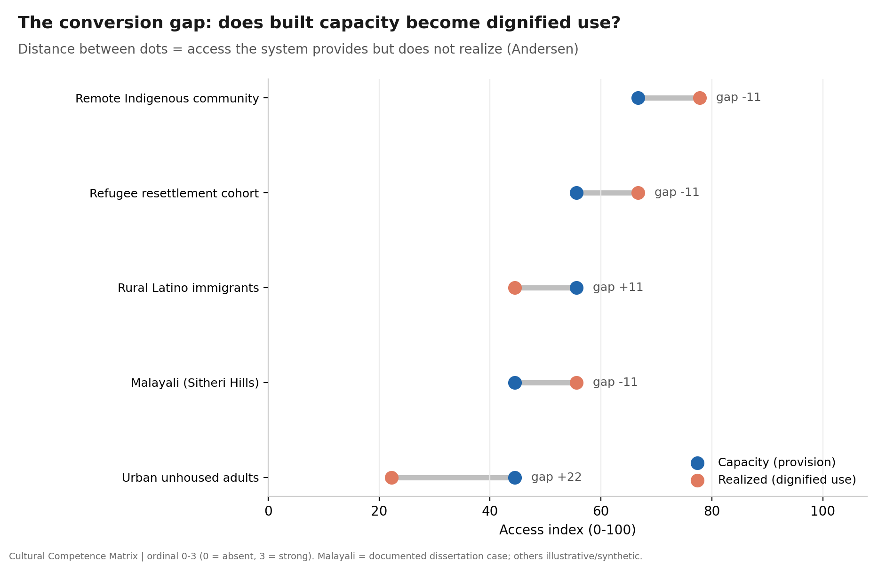
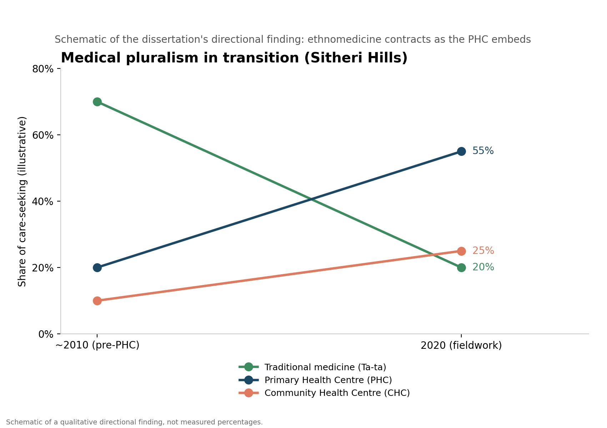

# Cultural Competence Matrix
### A Visualization Framework for Public Health Access in Marginalized Populations

[](https://github.com/OWNER/cultural-competence-matrix/actions/workflows/ci.yml)


<!-- Replace OWNER above with your GitHub username after publishing. -->

A small, reproducible R project that scores and visualizes how accessible a health
system is to a marginalized population across six evidence-based domains. The
framework is **population-agnostic by design**: swap in a new dataset and the
scoring, figures, and Shiny app regenerate unchanged. It is **illustrated** with a
documented field case — the Malayali of the Sitheri Hills, Tamil Nadu (author's MA
Medical Anthropology dissertation, Pondicherry University, 2020) — alongside
illustrative comparison populations.

> **At a glance:** ordinal 0–3 scoring → access indices (capacity vs. realized) →
> four polished `ggplot2` figures → an interactive `shiny` + `plotly` explorer.

---

## The framework

Six domains, each grounded in established health-services and cultural-competence
literature and mapped to **Betancourt's tri-level model** (organizational /
structural / clinical cultural competence) and **Andersen's Behavioral Model**
(potential vs. realized access).

| Domain | Betancourt level | Andersen stage | Access type |
|---|---|---|---|
| D1 · Organizational Representation & Workforce Concordance | Organizational | Enabling (system) | Capacity |
| D2 · Structural Access & Structural Competency | Structural + upstream | Enabling (potential) | Capacity |
| D3 · Language & Communication Fit | Structural ↔ Clinical | Enabling → realized | Capacity |
| D4 · Trust & Therapeutic Relationship | Clinical | Predisposing → realized | Realized |
| D5 · Perceived Respect & Dignity in Care | Clinical | Predisposing → realized | Realized |
| D6 · Pluralistic Care-Seeking & Navigation | Behavioral | Realized | Realized |

**Scoring scale (every domain):** `0` = absent/hostile · `1` = minimal ·
`2` = partial/conditional · `3` = strong/concordant.

The split between **capacity** domains (what the system provides) and **realized**
domains (whether that provision becomes trusted, dignified use) produces the
project's headline metric — the **conversion gap** — and a transferable diagnostic
label that tells a program *which level to intervene at*.

---

## Visualizations

**1 · Scored matrix heatmap** — the hero view: six domains × populations.


**2 · Radar profiles** — the *shape* of access; here the documented case vs. an
illustrative contrast that inverts it.


**3 · The conversion gap** — capacity (provision) vs. realized (dignified use) per
population, after Andersen.


**4 · Medical pluralism in transition** — a case-specific slope chart of the
dissertation's directional finding (ethnomedicine contracting as the PHC embeds).


Plus a small **Shiny app** (`shiny/app.R`) with interactive `plotly` heatmap and
radar, live access indices, a structural-access weighting toggle, and a CSV export.

---

## Quick start

```r
# 1. Install dependencies (once)
Rscript scripts/setup.R

# 2. Regenerate the four figures
Rscript scripts/generate_figures.R      # writes figures/*.png

# 3. Launch the interactive explorer
R -e 'shiny::runApp("shiny")'
```

Requires R ≥ 4.1 (the native pipe `|>` is used throughout).

> **Note:** the scored dataset is private (see *Data availability* below). The
> committed figures in `figures/` show the rendered output; to re-run the scripts
> or the Shiny app you'll need the dataset placed in `data/`.

---

## Data availability

The **scored dataset is not published in this repository**. Only the framework
definition (`data/domains_metadata.csv`) and the rendered figures are included.
The scored data (`example_matrix.csv`, `pluralism_transition.csv`) is held
privately and is **available on reasonable request** — please contact
**Kamalakanta Gahan** at **kgahan.duke@gmail.com** with a short note on intended
use. Full schema and instructions are in [`data/README.md`](data/README.md).

---

## Repository structure

```
cultural-competence-matrix/
├── README.md
├── analysis.Rmd                  # narrative walkthrough (knits to HTML)
├── LICENSE                       # MIT
├── cultural-competence-matrix.Rproj
├── .github/workflows/ci.yml      # CI: installs deps, validates scoring, builds figures
├── data/
│   ├── README.md                 # data dictionary + how to request the dataset
│   ├── domains_metadata.csv      # 6 domains + theory mapping & literature anchors
│   ├── example_matrix.csv        # (PRIVATE — not tracked; available on request)
│   └── pluralism_transition.csv  # (PRIVATE — not tracked; available on request)
├── R/
│   ├── load_data.R               # readers + validation (scores constrained 0–3)
│   ├── scoring.R                 # indices, capacity/realized split, diagnostics
│   └── theme_ccm.R               # shared ggplot2 theme + ordinal palette
├── scripts/
│   ├── setup.R                   # install dependencies
│   ├── generate_figures.R        # builds the 4 figures (canonical generator)
│   └── _render_previews.py       # optional: render PNG previews without R
├── figures/                      # committed figure previews (shown above)
└── shiny/
    └── app.R                     # interactive explorer
```

---

## How the scoring works

`R/scoring.R` is intentionally small and pure:

- **`compute_indices()`** — per population, the mean 0–3 score rescaled to a 0–100
  `composite_index`, plus `capacity_index` (D1–D3), `realized_index` (D4–D6), and
  their difference, `conversion_gap`.
- **`compute_level_profile()`** — mean score rolled up to Betancourt's
  organizational / structural / clinical levels (domains tagged for two levels
  contribute to both).
- **`classify_pattern()`** — a transferable, threshold-based diagnostic
  (e.g. *"capacity present, conversion gap"*, *"broad access deprivation"*,
  *"comparatively strong access"*).

Because the logic reads only the tidy data + metadata tables, applying the
framework to a new population is purely a **data** task — no code changes.

### Data dictionary (`example_matrix.csv`)

| column | meaning |
|---|---|
| `population` | group being assessed |
| `region` | geographic context |
| `case_type` | `Documented case` or `Illustrative (synthetic)` |
| `domain_id` | `D1`–`D6` (joins to `domains_metadata.csv`) |
| `score` | ordinal 0–3 |
| `provenance` | how the score was derived (ethnographic vs. illustrative) — keep visible so figures never imply false precision |

---

## Case application (illustrative, not the framework's source)

The **Malayali (Sitheri Hills)** column is scored from the author's dissertation:
an in-village Primary Health Centre raises structural access, conditional trust in
both biomedical and traditional (*Ta-ta*) care coexists, but the system is run by
outside staff with a documented "communication gap … more cultural in nature," low
scheme awareness, and social exclusion. The matrix renders this as **structural
presence with organizational and clinical gaps** — *hardware installed, cultural
software missing* — the same diagnostic the framework computes identically for any
population. All non-Malayali populations are **synthetic illustrations** included
only to exercise the visualizations; they are not empirical claims.

---

## Theoretical & literature grounding

Construct definitions draw on peer-reviewed literature (retrieved via PubMed):

- **Betancourt JR, et al.** *Defining cultural competence: a practical framework for
  addressing racial/ethnic disparities in health and health care.* Public Health Rep.
  2003;118(4):293–302. https://doi.org/10.1093/phr/118.4.293
- **Horvat L, et al.** *Cultural competence education for health professionals.*
  Cochrane Database Syst Rev. 2014;(5):CD009405.
  https://doi.org/10.1002/14651858.CD009405.pub2
- **Diamond L, et al.** *Patient-Physician Non-English Language Concordance and
  Quality of Care: A Systematic Review.* J Gen Intern Med. 2019;34(8):1591–1606.
  https://doi.org/10.1007/s11606-019-04847-5
- **Malone CM, et al.** *Centering structural competence in accreditation*
  (carrying forward Metzl & Hansen's structural competency). Psychotherapy. 2024;62(1):105–111.
  https://doi.org/10.1037/pst0000557
- **Dong L, et al.** *Provider training on intersectional stigma and medical
  mistrust: a pilot RCT.* Patient Educ Couns. 2026;149:109678.
  https://doi.org/10.1016/j.pec.2026.109678
- **Chowdhury HR, et al.** *Care seeking for fatal illness episodes in neonates
  (medical pluralism), rural Bangladesh.* BMC Pediatr. 2011;11:88.
  https://doi.org/10.1186/1471-2431-11-88

The Andersen Behavioral Model of Health Services Use informs the capacity-vs-realized
split.

---

## Author

**Kamalakanta Gahan** — MA, Medical Anthropology (Pondicherry University).
Project framing generalizes a dissertation case study into a reusable health-equity
visualization method.

*License: MIT. Comparison-population data are synthetic and for illustration only.*
